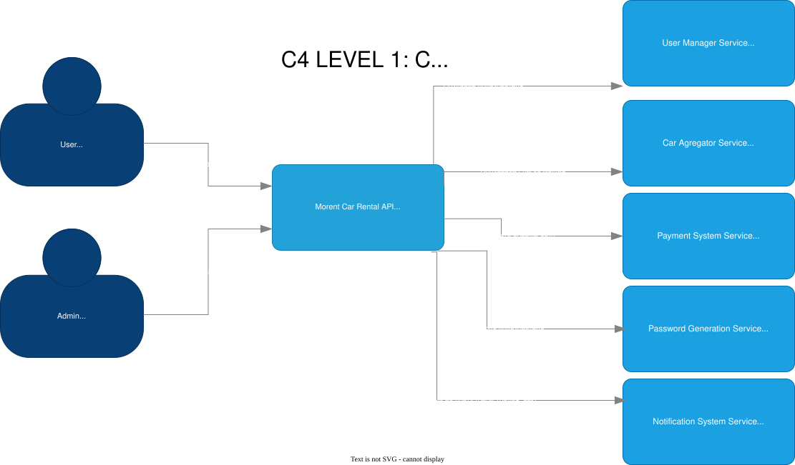
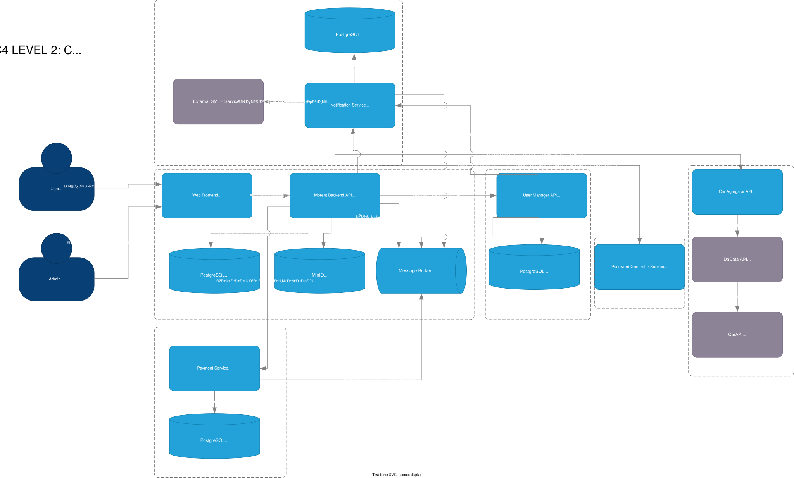
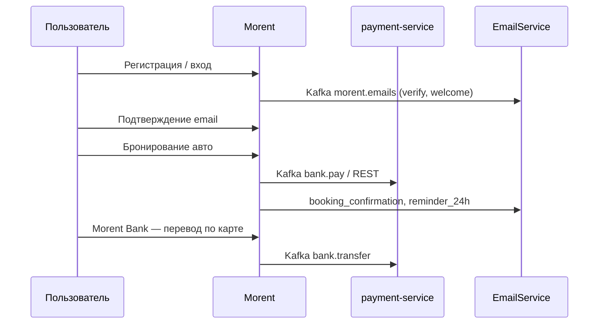

# Morent Architecture


Микросервисная платформа аренды автомобилей **Morent**: каталог и бронирование, Morent Bank (платежи), email-уведомления, RBAC пользователей, агрегатор автопредложений и вспомогательные сервисы. Сервисы связаны через общую шину **Kafka** и контракты в `shared/morent-events`.

## Состав репозитория

| Путь | Назначение |
| --- | --- |
| [`Morent-project/`](Morent-project/) | Основной продукт: React-фронт, Go-backend (аренда, админка, медиа MinIO, избранное, комментарии), **Morent Bank** через Kafka → `payment-service` |
| [`payment-service/`](payment-service/) | Счета, переводы по картам, оплата аренды, ledger, лимиты; **PostgreSQL** для счетов и клиентов банка |
| [`EmailService/`](EmailService/) | Отправка писем (SMTP), Worker + Kafka consumer; **PostgreSQL** — журнал статусов доставки |
| [`user-system-develop/`](user-system-develop/) | Пользователи, роли, права, компании (RBAC, JWT); синхронизация из Kafka `morent.users` |
| [`car-aggregator-project/`](car-aggregator-project/) | Поиск авто (CarAPI, DaData), управление `offers` |
| [`generator-service/`](generator-service/) | Генерация паролей и QR по HTTP |
| [`shared/morent-events/`](shared/morent-events/) | Общие Go-контракты Kafka (email, bank, users) |
| [`infra/kafka/`](infra/kafka/) | Kafka + Kafka UI для локальной разработки |
| [`docs/`](docs/) | Требования, use-cases, test-cases, C4-диаграммы |

Дополнительно: [`emailtest/`](emailtest/) — стенд для проверки EmailService.

## Архитектура (C4)





Исходник: [`docs/c4-diagrams/Morent-Arch-C4.drawio`](docs/c4-diagrams/Morent-Arch-C4.drawio)

## Витрина сервисов и порты (Docker / локально)

| Сервис | Назначение | Типичный порт |
| --- | --- | --- |
| Morent frontend | Web UI | `5173` |
| Morent PostgreSQL | Каталог, пользователи, аренды, сессии | `5433` |
| MinIO | Медиа, логи | `9000` / консоль `9001` |
| Redis | Кэш каталога | `6379` |
| payment-service | REST + Kafka bank consumer | `8081` |
| payment-service PostgreSQL | Счета, карты, переводы, платежи | `5438` |
| car-aggregator | REST API | `8080` |
| car-aggregator PostgreSQL | Офферы | `5436` |
| user-system | Auth / RBAC REST | `8082` |
| user-system PostgreSQL | RBAC | `5434` |
| EmailService API | Ingestion, webhooks | `5112` |
| EmailService PostgreSQL | Логи статусов писем (`EmailLogs`) | `5435` |
| generator-service | Password / QR API | `8080` |
| Kafka | Брокер событий | `9092` |
| Kafka UI | Просмотр топиков | `8090` |
| Elasticsearch | Централизованные логи | `9200` |
| Kibana | UI логов / heartbeat | `5601` |

Точные значения задаются в `.env` / `docker-compose` каждого сервиса.

## Что хранится в БД

| Сервис | СУБД | Содержимое |
| --- | --- | --- |
| **Morent** | PostgreSQL | Авто, аренды, пользователи (`emailVerified`, коды подтверждения), сессии, комментарии, избранное |
| **payment-service** | PostgreSQL | Счета, баланс, клиенты банка (телефон, карта, CVV, exp), сессии, переводы (в т.ч. номера карт), платежи аренды, ledger |
| **EmailService** | PostgreSQL | Только **статусы отправки** по `CorrelationId` (не текст писем и не шаблоны) |
| **user-system** | PostgreSQL | Пользователи, роли, права, компании |
| **car-aggregator** | PostgreSQL | Офферы и метаданные поиска |

Шаблоны писем — файлы в `EmailService/EmailService.Worker/Templates/`.

## Observability (Elasticsearch)

Централизованные логи и heartbeat всех сервисов:

```bash
make obs-up    # Elasticsearch :9200, Kibana :5601, Filebeat, Heartbeat
```

- Логи индексируются по шаблону `morent-logs-{service}-{log.type}-YYYY.MM.DD`
- Heartbeat пишет в `morent-heartbeat-*`
- Go-сервисы: JSON с полями `service`, `log_type` (`app`, `http`, `heartbeat`)
- Docker-метки: `co.elastic.logs/service`, `co.elastic.logs/log_type`

Подробнее: [`infra/observability/README.md`](infra/observability/README.md)

### Отказоустойчивость (кратко)

| Компонент | Поведение при сбое |
|-----------|-------------------|
| Morent Bank (Kafka → payment) | HTTP **503**, код `bank_unavailable` |
| Агрегатор (admin import) | **503** / **502** без утечки SQL |
| Generator (пароли) | **503** |
| Email (Kafka) | Warn в логах, регистрация/аренда не откатывается |
| Morent `/ready` | **503**, если недоступны Postgres или Redis |
| payment `/ready` | **503**, если недоступна БД |
| Frontend | `resilientFetch` — понятные сообщения при 5xx и обрыве сети |

Безопасные **500**: публичные JSON-ошибки без `err.Error()` в auth и rental.

## Kafka и общие контракты

Инфраструктура: `make kafka-up` → сеть `kafka_morent-kafka`.

| Топик | Направление | Смысл |
| --- | --- | --- |
| `morent.emails` | Morent → EmailService Worker | Запрос на письмо (`email_verification`, `welcome_registered`, `booking_confirmation`, `reminder_24h`, …) |
| `morent.bank.commands` / `morent.bank.responses` | Morent ↔ payment-service | Регистрация/вход в банк, перевод, оплата, профиль |
| `morent.users` | Morent → user-system | События пользователей для синхронизации RBAC |

Контракты: пакет [`shared/morent-events`](shared/morent-events/).

## Ключевые сценарии

- **Регистрация Morent** — без сессии до подтверждения email (6-значный код, `/verify-email`); письмо через Kafka → EmailService.
- **Повторный вход без verify** — новый код и редирект на подтверждение.
- **Аренда** — только для пользователей с `emailVerified`; письма о бронировании и напоминание в день аренды.
- **Morent Bank** — виртуальные карты, перевод по номеру карты, оплата аренды; данные в PostgreSQL `payment-service`.
- **Импорт авто** — админка Morent ↔ car-aggregator.
- **RBAC** — user-system, опционально Kafka-sync пользователей.

## Быстрый старт

### Требования

- Docker и Docker Compose
- Для локального запуска без Docker: Go 1.23+, Node.js (фронт), .NET 8 (EmailService)

### 1. Переменные окружения

Скопируйте `.env.example` → `.env` (где есть) в:

- `Morent-project/`
- `user-system-develop/`
- `car-aggregator-project/`
- `payment-service/`
- `EmailService/` (Api/Worker — см. README внутри сервиса)

Для Kafka из контейнеров часто нужен `KAFKA_BROKERS=kafka:9092` (в compose) или `host.docker.internal:9092` (с хоста).

### 2. Весь стек из корня репозитория

```bash
make up      # Kafka → user-system → Morent → EmailService → aggregator → payment → generator
make ps      # статус контейнеров
make down    # остановить всё
```

После `make up`:

- Morent UI: http://localhost:5173  
- Morent API: http://localhost:1488  
- Kafka UI: http://localhost:8090  
- EmailService API: http://localhost:5112  

Отдельные сервисы: `make morent-up`, `make payment-up`, `make email-up`, `make kafka-up` и т.д. — см. `make help`.

### 3. Минимальный контур для демо

1. `make kafka-up`
2. `make morent-up`
3. `make payment-up` (нужен для Morent Bank)
4. `make email-up` (письма регистрации и аренды)

Опционально: `user-system`, `car-aggregator`, `generator-service`.

### 4. Проверка

- Health/endpoints сервисов (Morent `1488`, payment `8081/health`, Email API).
- Сценарии из [`docs/test-cases.md`](docs/test-cases.md).

## Интеграционный flow



1. Пользователь регистрируется в Morent → код на email (EmailService).
2. После verify — полноценная сессия, доступ к аренде и банку.
3. Оплата/банк — `payment-service` (PostgreSQL).
4. Статусы аренды → события в `morent.emails` → Worker рендерит шаблон и отправляет.
5. user-system при необходимости получает `morent.users`.

## Документация

- [Функциональные требования](docs/functional-requirements.md)
- [Нефункциональные требования](docs/non-functional-requirements.md)
- [Use Cases](docs/use-cases.md)
- [Test Cases](docs/test-cases.md)
- [Product Vision](docs/PV/Morent-Product-Vision.pdf)

## README по сервисам

- [Morent-project](Morent-project/README.md)
- [car-aggregator-project](car-aggregator-project/README.md)
- [user-system-develop](user-system-develop/README.md)
- [generator-service](generator-service/README.md)
- Примеры payment API: [`payment-service/examples/`](payment-service/examples/)

## Технологический стек

| Слой | Технологии |
| --- | --- |
| Morent backend | Go, Uber FX, GORM, PostgreSQL, Redis, MinIO, gRPC |
| Morent frontend | React, Vite |
| payment-service | Go, GORM, PostgreSQL, Kafka |
| EmailService | .NET, EF Core, PostgreSQL, Kafka, RabbitMQ, SMTP/Resend |
| user-system | Go, GORM, PostgreSQL, Kafka, JWT |
| car-aggregator | Go, GORM, PostgreSQL |
| generator-service | Go |
| Интеграции | Kafka, REST, gRPC; внешние API CarAPI, DaData |
| Инфра | Docker Compose, Makefile (`make up`, `make obs-up`), Elasticsearch + Filebeat + Heartbeat |

## Статус

Учебно-демонстрационный монорепозиторий с рабочими интеграциями: Kafka между Morent, банком и почтой, персистентный payment-service, верификация email и transactional-письма. C4 и требования в `docs/` описывают целевую архитектуру; детали реализации — в README и коде каждого сервиса.
