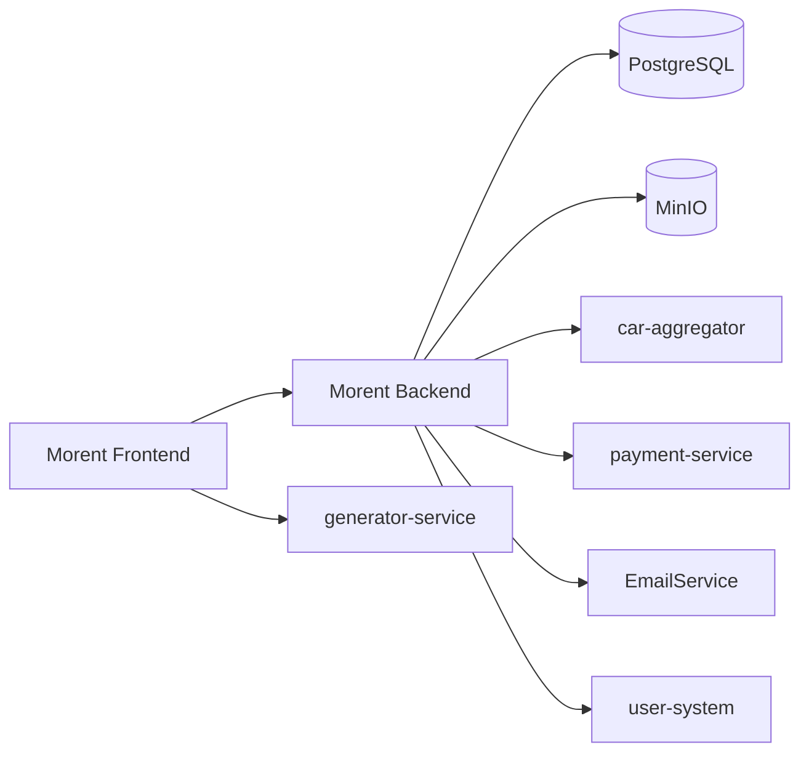

# Morent Architecture

Микросервисная экосистема для платформы аренды автомобилей: клиентский продукт Morent, сервисы аутентификации и ролей, агрегатор автопредложений, платежный контур, email-уведомления и утилитарный сервис генерации.

## Состав репозитория

- `Morent-project` — основной продукт (frontend + backend, admin, аренда, избранное, комментарии, медиа).
- `car-aggregator-project` — поиск автомобилей через CarAPI + DaData, управление `offers`.
- `user-system-develop` — управление пользователями, ролями, правами и компаниями (RBAC, JWT).
- `payment-service` — счета, переводы, лимиты, идемпотентность, ledger и реверс операций.
- `EmailService` — прием email-запросов, очередь, worker, статусы доставки и webhook.
- `generator-service` — генерация паролей и QR-кодов через HTTP API.
- `docs` — требования, use-cases, test-cases, C4 и материалы по продукту.

## Ключевые сценарии

- Регистрация/вход пользователя и разграничение прав.
- Поиск автомобилей, бронирование, отмена аренды.
- Интеграция Morent с агрегатором для импорта авто.
- Интеграция Morent с payment-service для оплаты аренды.
- Интеграция Morent с EmailService для уведомлений.

## Архитектурный обзор

## Витрина сервисов

| Сервис | Назначение | Основные интерфейсы | Порт (типично) |
| --- | --- | --- | --- |
| `Morent-project/frontend` | Клиентское приложение | Web UI | `5173` (dev) |
| `Morent-project/backend` | Каталог, аренда, админка, медиа | REST/GraphQL, gRPC bookings | `1488` (HTTP), `50051` (gRPC) |
| `car-aggregator-project` | Поиск авто через CarAPI + DaData | `POST /search/trims`, offer endpoints | `8080` |
| `user-system-develop` | Пользователи, роли, права, компании | Auth/RBAC REST + OpenAPI | из `.env` |
| `payment-service` | Счета, переводы, лимиты, ledger | REST API платежей | из `.env` |
| `EmailService` | Отправка email, очередь, webhook | Ingestion API, status API, webhook | из `appsettings/.env` |
| `generator-service` | Генерация паролей и QR | `/api/v1/password`, `/api/v1/qrcode` | `8080` |

> В монорепо порты конфигурируются через переменные окружения; значения выше — ориентиры для локальной разработки.

## Быстрый старт

### 1) Подготовка

- Установить `Docker` и `Docker Compose`.
- Для сервисов, где требуется, создать `.env` из `.env.example`.

### 2) Запуск сервисов

Запускай каждый сервис из его директории (или через общий сценарий, если используешь свой compose-оркестратор):

- `Morent-project`
- `car-aggregator-project`
- `user-system-develop`
- `payment-service`
- `EmailService`
- `generator-service`

Минимальный рабочий контур для демо:

1. `Morent-project` (frontend + backend + db/minio)
2. `car-aggregator-project`
3. `payment-service`
4. `EmailService`

### 3) Проверка

- Убедиться, что сервисы отвечают на свои `health`/основные endpoints.
- Проверить интеграционные сценарии из `docs/test-cases.md`.

## Интеграционный flow (коротко)

1. Пользователь авторизуется в Morent.
2. В каталоге выбирает авто и создает аренду.
3. При необходимости админ импортирует авто из агрегатора.
4. Morent инициирует платеж через `payment-service`.
5. После смены статуса аренды Morent отправляет событие в `EmailService`.
6. Пользователь получает уведомление и видит актуальный статус в интерфейсе.

## Документация

- Функциональные требования: `docs/functional-requirements.md`
- Нефункциональные требования: `docs/non-functional-requirements.md`
- Use Cases: `docs/use-cases.md`
- Test Cases: `docs/test-cases.md`
- Архитектура: `docs/c4-diagrams/Morent-Arch-C4.drawio`
- Product Vision: `docs/PV/Morent-Product-Vision.pdf`

## Быстрые ссылки по API

- Morent backend: `Morent-project/README.md`
- Car aggregator: `car-aggregator-project/README.md`
- User system OpenAPI: `user-system-develop/docs`
- Generator API примеры: `generator-service/README.md`
- Payment examples: `payment-service/examples`

## Технологический стек

- Backend: `Go`, `GORM`, `PostgreSQL`
- Frontend: `React`, `Vite`
- Интеграции: `REST`, `gRPC`, `RabbitMQ` (в user-system), внешние API (CarAPI, DaData)
- Infra: `Docker`, `Docker Compose`, `MinIO`
- Дополнительно: `.NET` (EmailService), Go-сервисы (aggregator/payment/generator)

## Статус

Проект предназначен для учебной демонстрации микросервисной архитектуры с реальными интеграционными сценариями и разделением ответственности по сервисам.
